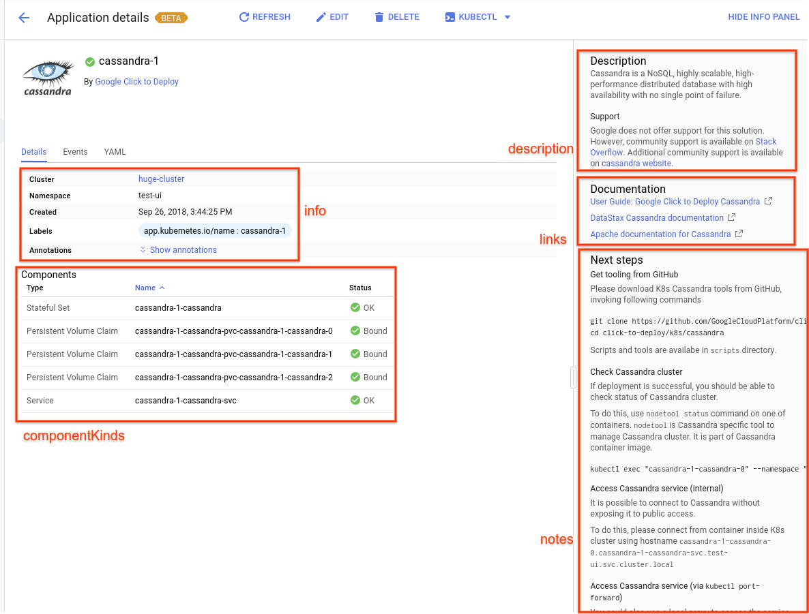

# Building Helm Deployer

The key words "MUST", "MUST NOT", "REQUIRED", "SHALL", "SHALL
NOT", "SHOULD", "SHOULD NOT", "RECOMMENDED",  "MAY", and
"OPTIONAL" in this document are to be interpreted as described in
RFC 2119.

## Prerequisites

See [this doc](tool-prerequisites.md).

## Part 1: Up and running

The goal of this step is to build the minimal deployer to deploy your
helm chart.

In this tutorial, we use the public `wordpress` helm chart as the
example to import.

Set up a clean directory to house all of your deployer contents. This
directory is assumed to be the working directory from now on.

### Download the helm chart

```shell
helm fetch --untar --destination chart stable/wordpress
```

This will result in the following directory structure:

```text
.
└── chart
    └── wordpress
        ├── charts
        │   └── mariadb
        │       ├── Chart.yaml
        │       ├── templates
        │       │   └── ... # Template files
        │       └── values.yaml
        ├── Chart.yaml
        ├── README.md
        ├── requirements.lock
        ├── requirements.yaml
        ├── templates
        │   └── ... # Template files
        └── values.yaml
```

### Create the initial schema

Create a `schema.yaml` at the top level.

```text
.
├── schema.yaml
└── chart
    └── wordpress
        └── ... # Chart contents
```

Use the following content:

```yaml
x-google-marketplace:
  schemaVersion: v2

  applicationApiVersion: v1beta1
  # The published version is required and MUST match the tag
  # of the deployer image
  publishedVersion: '9.0.3'
  publishedVersionMetadata:
    releaseNote: >-
      A first release.
  # The images property will be filled in during part 2
  images: {}

properties:
  name:
    type: string
    x-google-marketplace:
      type: NAME
  namespace:
    type: string
    x-google-marketplace:
      type: NAMESPACE

required:
- name
- namespace
```

### Add an application descriptor

In the main chart's `templates` directory, add `application.yaml`
with the following content. This manifest describes the application
and is used in the UI.

It's important to note that `partner_id` and `product_id` must match
the values declared in the schema, `partnerId` and `solutionId`
respectively, which must also match your listing ID in Marketplace.

```yaml
apiVersion: app.k8s.io/v1beta1
kind: Application
metadata:
  name: "{{ .Release.Name }}"
  namespace: "{{ .Release.Namespace }}"
  labels:
    app.kubernetes.io/name: "{{ .Release.Name }}"
  annotations:
    marketplace.cloud.google.com/deploy-info: '{"partner_id": "partner", "product_id": "wordpress", "partner_name": "Partner"}'
spec:
  descriptor:
    type: Wordpress
    version: '9.0.3'
  selector:
    matchLabels:
      app.kubernetes.io/name: "{{ .Release.Name }}"
  addOwnerRef: true
  componentKinds:
  - group: ''
    kind: PersistentVolumeClaim
  - group: ''
    kind: Secret
  - group: ''
    kind: Service
  - group: apps
    kind: Deployment
```

### Build your deployer container

When you have the above directory structure, you can
use the `onbuild` version of container image to simplify
the process. To summarize, the directory structure is similar
to the following:

```text
.
├── chart
│   └── wordpress
│       ├── charts
│       │   └── mariadb
│       │       └── ... # subchart contents
│       ├── Chart.yaml
│       ├── README.md
│       ├── requirements.lock
│       ├── requirements.yaml
│       ├── templates
│       │   ├── application.yaml
│       │   └── ... # other templates
│       └── values.yaml
├── Dockerfile
└── schema.yaml
```

Create a `Dockerfile` at the top level with the following
content:

```Dockerfile
FROM gcr.io/cloud-marketplace-tools/k8s/deployer_helm/onbuild
```

**Note:** The helm deployer has been upgraded to use helm v3. The helm deployer
only uses `helm template` functionality, but if your chart is incompatible
with helm3, you can use the helm v2 deployer
`gcr.io/cloud-marketplace-tools/k8s/deployer_helm2/onbuild` instead.

Then you can build your container as follows:

```shell
# Set the registry to your project GCR repo.
export REGISTRY=gcr.io/$(gcloud config get-value project | tr ':' '/')
export APP_NAME=wordpress

docker build --tag $REGISTRY/$APP_NAME/deployer .
```

Push your built to the remote GCR so that your app running
in your GKE cluster can access the image:

```shell
docker push $REGISTRY/$APP_NAME/deployer
```

### First deployment

Create a new namespace to cleanly deploy your app:

```shell
kubectl create namespace test-ns

mpdev install \
  --deployer=$REGISTRY/$APP_NAME/deployer \
  --parameters='{"name": "test-deployment", "namespace": "test-ns"}'
```

The `install` script simulates what the UI would do deploying your
application. The app parameters are specified in a JSON string here.
In the UI, the user would have configured these parameters in a form.

You can see your application in GKE UI by following this link:

```text
https://console.cloud.google.com/kubernetes/application?project=YOUR_PROJECT
```

### Troubleshooting

The deployer job/pod might fail if your application tries to create
cluster-wide objects, such as `CustomResourceDefinition`, `StorageClass`,
or `ClusterRole` and `ClusterRoleBinding`. This is because the deployer
is only allowed to create namespaced resources.

- `ClusterRole` and `ClusterRoleBinding`: Please see the RBAC section
  in Part 2 below.
- `StorageClass`: If your application uses a storage class, see Part 2
  on how to configure your schema. If your application provides a
  `StorageClass` (i.e. your application is a storage provisioner),
  the resource must be created by the application with a properly
  configured service account. See RBAC section in Part 2 on how to set
  up such a service account.
- Other cluster scoped resources: These resources must be created by
  the application with a properly configured service account. See RBAC
  section in Part 2 on how to set up such a service account.

## Part 1b: Optional: Creating a wrapper chart

One way to import your upstream chart as-is is to create a wrapper
charter. This top level chart has a single dependency which is the
main chart.

**NOTE**: The main caveat here is that existing upstream instructions
for changing the values cannot be used as-is. All values have to be
prefixed with the upstream chart name. See below for more details.

In this example, we create a new `wordpress-mp` chart that uses the
main `wordpress` chart. Create the following directory structure:

```text
.
├── chart
│   └── wordpress-mp
│       ├── Chart.yaml
│       ├── requirements.yaml
│       ├── templates
│       │   └── application.yaml  # Same as in Part 1
│       └── values.yaml
├── Dockerfile                    # Same as in Part 1
└── schema.yaml                   # Same as in Part 1
```

Use the following content for `Chart.yaml`:

```yaml
engine: gotpl
name: wordpress-mp
version: 1.0.0
```

Use the following content for `requirements.yaml`.

```yaml
dependencies:
- name: wordpress
  version: 9.x.x
  repository: https://kubernetes-charts.storage.googleapis.com/
```

For starters, use an empty `values.yaml`. The nice thing about this
file is that values from the upstream chart can be respecified here.
For example, to override `wordpressUsername`, this top level values
file can specify a new value for `wordpress.wordpressUsername`.
For more details, see helm's
[documentation](https://github.com/helm/helm/blob/master/docs/chart_template_guide/subcharts_and_globals.md#overriding-values-from-a-parent-chart).

Run the following helm command to download the wordpress chart.

```shell
helm dependency build chart/wordpress-mp
```

This will add a `charts` directory under `wordpress-mp`. The final
directory structure looks like this:

```text
.
├── chart
│   └── wordpress-mp
│       ├── charts
│       │   └── wordpress-9.0.3.tgz
│       ├── Chart.yaml
│       ├── requirements.lock
│       ├── requirements.yaml
│       ├── templates
│       │   └── application.yaml
│       └── values.yaml
├── Dockerfile
└── schema.yaml
```

You can now rebuild your deployer container and install the
application.

## Part 2: Crafting the schema

`schema.yaml` is a basic JSON schema with Marketplace extensions.
See this [document](schema.md) for more references.

### Declare RBAC requirements (and disable RBAC in the chart)

While helm
[recommends](https://github.com/helm/helm/blob/master/docs/chart_best_practices/rbac.md)
that charts should create RBAC resources by default, Marketplace
requires that charts __must not__ create k8s service accounts or
RBAC resources.

Modify your charts' `values.yaml` to disable service account and RBAC
resource creation. (Note that the wordpress example does not create a service
account and this step is not required for all charts). If you created the
recommended wrapper chart, you can easily add override values to do this.

There should be a service account value that the charts take. The
service account is specified under `podSpec` attribute of workload
types, like `Deployment`, `StatefulSet`. Assume it to be
`{{ .Values.controller.serviceAccount }}`, you can add the
following property to your `schema.yaml`.

```yaml
properties:
  controller.serviceAccount:
    type: string
    x-google-marketplace:
      type: SERVICE_ACCOUNT
      serviceAccount:
        roles:
        - type: ClusterRole
          rulesType: PREDEFINED
          rulesFromRoleName: edit
```

(Don't forget to include the name of the subchart if you're modifying
the subchart's value, e.g. `wordpress.controller.serviceAccount` with
our wrapper chart example above.)

At deploy time, the service account with appropriate role bindings is
created by the UI and passed to the deployer. The UI also allows the
end user to select an existing service account instead. In the example
above, a service account with a cluster role `edit` (a system default
cluster role) should be passed to the deployer.

### Parameterize the images

Marketplace solutions must and can only use images that live on
the official `marketplace.gcr.io`. Thus, __all__ images used in
the charts (and subcharts) must be parameterized.

Each image must have a corresponding property. At deployment time,
the official images will be supplied via these properties.

As an example, the following two images are used in the wordpress
chart and its mariadb subchart:

```yaml
# wordpress values.yaml
image:
  registry: docker.io
  repository: bitnami/wordpress
  tag: 5.3.2
---
# mariadb values.yaml
image:
  registry: docker.io
  repository: bitnami/mariadb
  tag: 10.1.33
```

To override wordpress `repository` value, we want this
property name: `image.repository`. To override mariadb
`repository` value, note that it's a subchart, and thus we want
to use `mariadb.image.repository`.

If you following the recommendation of creating a wrapper
chart `wordpress-mp`, the two properties should be
`wordpress.image.repository` and
`wordpress.mariadb.image.repository`. The schema
file should then look like this:

```yaml
 # Under the x-google-marketplace parent attirbute
  images:
    wordpress:
      properties:
        wordpress.image.registry:
          type: REGISTRY
        wordpress.image.repository:
          type: REPO_WITHOUT_REGISTRY
        wordpress.image.tag:
          type: TAG
    mariadb:
      properties:
        wordpress.mariadb.image.registry:
          type: REGISTRY
        wordpress.mariadb.image.repository:
          type: REPO_WITHOUT_REGISTRY
        wordpress.mariadb.image.tag:
          type: TAG
```

Note that `wordpressImage` is also available to your helm chart
as a value `{{ .Values.wordpressImage }}`. The name here can be
arbitrary. `mardiadbImage` is similar.

These image properties __must__ have valid default values. These
tell Marketplace where to find these images and republish them to
the official `marketplace.gcr.io`. These defaults __should__ use
the same GCR repo as your deployer image, as they __should__ be
managed by your build pipeline.

You __should not__ use images that are not under your control.
If your application uses some commonly available image like
`busybox`, make a copy of that image and ensure that it is free
of any vulnerability or malicious code.

Note that end users never see or need access to these default
image names.

_One last reminder_: __all__ images in all charts and subcharts
__must__ be parameterized this way. Only official Marketplace
images are allowed to run in end user's environment.

### Declare parameters user can configure

Reasonable last-mile configuration parameters should be exposed in the
UI form to end users. These parameters should already be in
`values.yaml`. You can add them as properties into the schema.

For example, wordpress `values.yaml` has the following values:

```yaml
wordpressUsername: user
wordpressPassword: null
wordpressBlogName: User's blog
```

Assume you have a wrapper chart created from Part 1b, you can expose
these knobs to the end users as follows:

```yaml
properties:
  wordpress.wordpressBlogName:
    type: string
    default: Your blog name
    description: Enter the name of your blog
  wordpress.wordpressUsername:
    type: string
    default: user
    description: User name to log in to your blog
  wordpress.wordpressPassword:
    type: string
    x-google-marketplace:
      type: GENERATED_PASSWORD
      generatedPassword:
        length: 10
        includeSymbols: True
        base64: False
required:
- wordpress.wordpressBlogName
- wordpress.wordpressUsername
- wordpress.wordpressPassword
```

## Part 3: Crafting application manifest

We follow the standard application resource specified by
[k8s sig-apps](https://github.com/kubernetes-sigs/application).
There are also a few additional guide lines for Marketplace.

A full example of the application manifest can be found
[here](https://github.com/GoogleCloudPlatform/click-to-deploy/blob/master/k8s/cassandra/manifest/application.yaml.template).

### UI

The application manifest drives the deployed application UI:



### Application API version

As of this writing, we use `v1beta1`. If you change the version
of the application resource, you __must__ update the schema as well.

```yaml
# schema.yaml

applicationApiVersion: v1beta1
```

### Adding an icon

Your application icon should be a PNG of size 200x200.
The binary content of the PNG should be base64 encoded and inlined
into the `icon` field of `application.yaml`.

```yaml
apiVersion: app.k8s.io/v1beta1
kind: Application
metadata:
  annotations:
    kubernetes-engine.cloud.google.com/icon: data:image/png;base64,iVBORw0KGgoAAAANSUhEUgAAAIIAAACCCA...
```

Note that k8s API objects have size limits, so a large PNG is
strongly discouraged.

### Marketplace metadata

Add the following annotation. `partner_id` and `product_id` __must__
match the identifiers chosen for the listing. This usually happens
early on in the onboarding process. If you are unsure, contact your
Google partner engineer.

```yaml
kind: Application
metadata:
  annotations:
    marketplace.cloud.google.com/deploy-info: '{partner_id: "your-partner-id", product_id: "your-product-id", partner_name: "Human Friendly Name"}'
```

### Application components

`componentKinds` and `selector` together select the resources
that are considered part of the application. Here is an example:

```yaml
spec:
  selector:
    matchLabels:
      app.kubernetes.io/name: "{{ .Release.Name }}"
  componentKinds:
  - group: apps/v1beta2
    kind: Deployment
  - group: batch/v1
    kind: Job
  - group: v1
    kind: PersistentVolumeClaim

```

Note that `app.kubernetes.io/name` is a standard label that is
recommended by k8s sig-apps. This label is automatically applied
on all resources in the chart. Also recall from the schema
specification, the name of the application is also the name of
the helm release.

### Application information table

The information table is useful for showing quick information or
links for the end user to access the application, such as the
application web site.

Here is an example. It defines one entry that references a k8s
`Secret` resource. It also specifies the port and URL path.

```yaml
spec:
  info:
  - name: Blog site (HTTP)
    type: Reference
    valueFrom:
      type: ServiceRef
      serviceRef:
        name: {{ .Values.serviceName }}
        port: 80
        path: /
```

See [InfoItem struct](https://github.com/kubernetes-sigs/application/blob/master/pkg/apis/app/v1beta1/application_types.go)
for more details.

### Application notes

The notes appear on the deployed application page. They are intended
to provide end-user with quick start instructions to start using
the application. They are in Markdown format.

Extended documentation __should not__ be captured in the notes.
Instead, provide links from within the notes. There is also a `links`
section in the application spec.

## Part 4: Finishing touches

### Optional: Using our Makefile

Simplified user commands. Good for CI/CD.

TODO

### Images in staging GCR

The staging GCR hosts all application and deployer images that
Marketplace will copy and republish into the public
`marketplace.gcr.io`. Images in the staging repo are never
visible to the end users. As an example, let's assume your staging
repo is `gcr.io/your-company/wordpress`.

For each solution, there is always one deployer image with the
predefined name `deployer`. There is usually a primary application
image named `wordpress` in this case. For this example, let's say
your application uses an additional image called `mariadb`.

Each track of your application is associated with a track tag, which
should be the same name. If you don't know what a track is, see the
general
[onboarding guide](https://cloud.google.com/marketplace/docs/partners/kubernetes-solutions/set-up-environment#product-identifiers).
See [this section](building-deployer.md#publishing-a-new-version)
for more information about tags. Let's say your application has a
track named `9.0`, and that the current release for this track is `9.0.3`.

Your GCR repo should have the following images:

```text
gcr.io/your-company/wordpress/wordpress:9.0.3
# The deployer excludes the patch version in SemVer
gcr.io/your-company/wordpress/deployer:9.0
gcr.io/your-company/wordpress/mariadb:9.0.3
```

Then your schema should look similar to the following:

```yaml
  images:
    wordpress:
      properties:
        wordpress.image.registry:
          type: REGISTRY
        wordpress.image.repository:
          type: REPO_WITHOUT_REGISTRY
        wordpress.image.tag:
          type: TAG
    mariadb:
      properties:
        wordpress.mariadb.image.registry:
          type: REGISTRY
        wordpress.mariadb.image.repository:
          type: REPO_WITHOUT_REGISTRY
        wordpress.mariadb.image.tag:
          type: TAG
```

The properties of each image in `images` are used by Marketplace to
parameterize the images in `values.yaml` for your chart. The name of
the primary image in `schema.yaml` is `wordpress` such that
marketplace looks for the image at `gcr.io/your-company/wordpress/wordpress`.
The second image name is `mariadb` such that marketplace determines
the image is `gcr.io/your-company/wordpress/mariadb`

#### CI/CD

Note that all these images share the same registry
(`gcr.io/your-company/wordpress`) and the same tag (`9.0.3`).
To facilitate CI/CD, where you have separate repos and tags
for testing and staging, assuming that you build your deployer
image using the `onbuild` variation of the base deployer,
you can use 2 environment variables `$REGISTRY` and `$TAG`
in your `schema.yaml`. For example, you can set the 
`publishedVersion` to `"$TAG"` as shown below:

```yaml
x-google-marketplace:
  schemaVersion: v2
  applicationApiVersion: v1beta1
  publishedVersion: "$TAG"
```

The docker build command for the deployer image looks like this:

```shell
docker build \
  --build-arg REGISTRY=gcr.io/your-company/wordpress \
  --build-arg TAG=9.0.3 \
  --tag gcr.io/your-company/wordpress/deployer:9.0 .
```

### Running a verification

A verification should be run prior to submission of a version.
Marketplace will do similar verification on our end. A version
must pass all verifications in order to be approved.

Use the following command:

```shell
mpdev /scripts/verify \
  --deployer=gcr.io/your-company/wordpress/deployer:9.0
```

This script will create a new test namespace, deploy the app,
verify that it will become healthy, and uninstall it.

If your app requires some additional parameters other than
name and namespace, you can supply them via `--parameters`,
similar to the install command.

### Submitting a version

See [this section](building-deployer.md#publishing-a-new-version).

## Part 5: Add verification integration

Follow [instructions](verification-integration.md) to integrate the application with our verification system.
