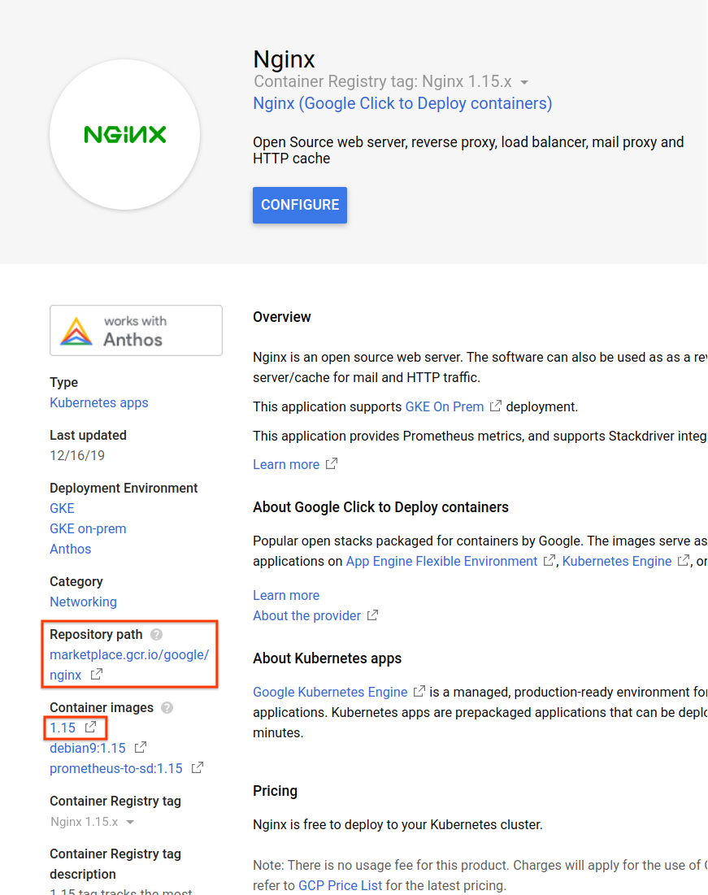

# Dev container references

## Overview and setup

Our dev container `gcr.io/cloud-marketplace-tools/k8s/dev`
bundles all the libraries needed for development.

When the dev container is run, gcloud configurations and
`kubeconfig` on the host are forwarded and used for invoking
`gcloud` and `kubectl`/k8s commands. To facilitate this,
the container has a script that can be extracted and used
directly in your local environment.

The following creates an executable `mpdev` in your user bin
directory. Note: if there isn't already a `bin` directory in
your home directory, you'll need to create it, and then either
add it to `$PATH` manually or log out and then log back in to
ensure that it is automatically added to `$PATH`.

```shell
BIN_FILE="$HOME/bin/mpdev"
docker run \
  gcr.io/cloud-marketplace-tools/k8s/dev \
  cat /scripts/dev > "$BIN_FILE"
chmod +x "$BIN_FILE"
```

Run the following to make sure that the dev tool is working:

```shell
mpdev
```

## Commands

### Diagnose your environment

The doctor tool inspects your setup and recommends potential
fixes.

```shell
mpdev doctor
```

### Install an application

This command is mostly equivalent to installing an application
from the Marketplace UI.

```shell
mpdev install \
  --deployer=<YOUR DEPLOYER IMAGE> \
  --parameters=<PARAMETERS AS JSON DICTIONARY>

# For example:
mpdev install
  --deployer=gcr.io/your-company/your-solution/deployer \
  --parameters='{"name": "test-deployment", "namespace": "test-ns"}'
```

### Delete an application

You can delete an application by directly deleting the application
custom resource.

```shell
kubectl delete application <APPLICATION DEPLOYMENT NAME>
```

### Smoke test an application

This script creates a new namespace, deploys the application, waits
for it to turn green, runs any smoke tests, and tears it down.
Make sure it runs successfully before submitting the application to marketplace.

```shell
mpdev verify \
  --deployer=<YOUR DEPLOYER IMAGE>
```

The `verify` command does not take parameters as in `install` command.
Instead, it uses the default values declared in the schema file.

If a property has no default value declared in `/data/schema.yaml`,
it has to be declared in `/data-test/schema.yaml` (with exception
of `NAME` and `NAMESPACE`, which are auto-generated during verification).

For example, suppose that `/data/schema.yaml` looks like the following:

```yaml
applicationApiVersion: v1beta1
properties:
  name:
    type: string
    x-google-marketplace:
      type: NAME

  namespace:
    type: string
    x-google-marketplace:
      type: NAMESPACE

  instances:
    type: int
    title: Number of instances
```

Because `instances` does not contain a default value, a default value of
`instances` must be declared in `/data-test/schema.yaml`, like so:

```yaml
properties:
  instances:
    type: int
    default: 2
```

Properties in `/data-test/schema.yaml` will override properties in
`/data/schema.yaml`. This can also be used to overwrite existing default
values for verification.

## Installing a published Marketplace app

`mpdev` is intended for developing your application prior to publishing to
Google Cloud Marketplace, but it can also be used to deploy a published
Marketplace app, as described in the following sections.

### Locate the desired deployer image

From an app listing details page on Marketplace (for example
[nginx](https://console.cloud.google.com/marketplace/details/google/nginx)),
locate the container repository path on the left hand side. Also notice
the image tag under `Container images` section.



The desired deployer image is `[REPOSITORY_PATH]/deployer:[TAG]`.
Pull and make the image available locally.

```shell
IMAGE=[REPOSITORY_PATH]/deployer:[TAG]

docker pull $IMAGE
```

Inspect the schema of the deployer to determine the following:
- Schema version
- Parameters to fill out

```shell
docker run --rm --entrypoint /bin/bash $IMAGE -c 'cat /data/schema.yaml'
```

### Get a copy of the deployment parameters

To deploy an application, its required parameters have to be filled out.
One way is to fill out the parameters yourself. Another way to obtain these
parameters is to create a deployment using Marketplace UI and make a copy
of the parameters generated by the UI form, as follows.

NOTE: Commands are different for the two versions of the schema.
Inspect the deployer image schema using the command in the section above.

```shell
APPLICATION_INSTANCE=nginx-1
APPLICATION_NAMESPACE=default

# Make sure that kubectl is pointing to the right cluster and
# no typos in the names. This should succeed.
kubectl get application/$APPLICATION_INSTANCE -n $APPLICATION_NAMESPACE

# Use the following for schema v2.
# Note: you need to have yaml install for python.
ARGS_JSON="$(kubectl get secret/$APPLICATION_INSTANCE-deployer-config \
  --namespace $APPLICATION_NAMESPACE \
  -o go-template='{{index .data "values.yaml"}}' \
  | base64 -d \
  | python -c 'import json, sys, yaml ; y=yaml.safe_load(sys.stdin.read()) ; print(json.dumps(y))')"

# Use the following for schema v1.
# Note: you need to have jq installed.
ARGS_JSON="$(kubectl get configmap/$APPLICATION_INSTANCE-deployer-config \
  --namespace $APPLICATION_NAMESPACE -o json \
  | jq '.data')"

echo $ARGS_JSON
```

### Install the app

```shell
mpdev install \
  --deployer=$IMAGE \
  --parameters="$ARGS_JSON"
```
